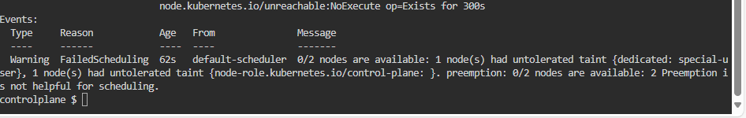

# CKA-Exam-Practice-Questions
Certified Kubernetes Administrator Mock Exam Real Questions 

## Hyperlink Section  
- [Q1: Create a Pod with Special Capabilities](#q1-weightage-7)  
- [Q2: Upgrade Deployment Image Version](#q2-weightage-11)  
- [Q3: Scale a Deployment](#q3-weightage-7)  
- [Q4: Deploy a Pod with Labels](#q4-weightage-4)  
- [Q5: Create a Static Pod](#q5-weightage-4)  
- [Q6: Create a Multi-Container Pod](#q6-weightage-7)  
- [Q7: Create a Pod in a Custom Namespace](#q7-weightage-5)  
- [Q8: Get Node Info in JSON Format](#q8-weightage-4) 
- [Q9: Get Nodes oslmages Query Info in JSON Format](#q9-weightage-5) 

---

## Q1: **Weightage: 7%**

**Task:**  
Create a new pod called `web-pod` with the image `busybox`. Allow the pod to set `system_time`. The container should sleep for 3200 seconds.

**Answer:**  
1. Create the pod using the dry-run command:
    ```bash
    kubectl run web-pod --image=busybox --command sleep 3000 --dry-run=client -o yaml > web-pod.yaml
    ```

2. Edit the `web-pod.yaml` file:
    ```bash
    vi web-pod.yaml
    ```

3. Update the YAML file with the following:
    ```yaml
    apiVersion: v1
    kind: Pod
    metadata:
      creationTimestamp: null
      labels:
        run: web-pod
      name: web-pod
    spec:
      containers:
      - command:
        - sleep
        - "3000"
        image: busybox
        name: web-pod
        securityContext:  # Add this line
          capabilities:   # Add this line
            add: ["SYS_TIME"]  # Add this line
        resources: {}
      dnsPolicy: ClusterFirst
      restartPolicy: Always
    status: {}
    ```

4. Run the create command:
    ```bash
    kubectl create -f web-pod.yaml
    ```

---

## Q2: **Weightage: 11%**

**Task:**  
Create a new deployment called `myproject` with the image `nginx:1.16` and 1 replica. Next, upgrade the deployment to version `1.17` using a rolling update. Ensure the version upgrade is recorded in the resource annotation.

**Answer:**  
1. Create the deployment and save it as a backup:
    ```bash
    kubectl create deployment myproject --image=nginx:1.16 --replicas=1 --dry-run=client -o yaml > myproject.yaml
    kubectl create deployment myproject --image=nginx:1.16 --replicas=1
    ```

2. Upgrade the image version:
    ```bash
    kubectl set image deployment/myproject nginx=nginx:1.17 --record
    ```

---

## Q3: **Weightage: 7%**

**Task:**  
Create a new deployment called `my-deployment`. Scale the deployment to 3 replicas and ensure the desired number of pods are always running.

**Answer:**  
1. Create the deployment with dry-run, verify it, and apply it:
    ```bash
    kubectl create deployment my-deployment --image=nginx --replicas=3 --dry-run=client -o yaml > my-deployment.yaml
    kubectl create -f my-deployment.yaml
    ```

---

## Q4: **Weightage: 4%**

**Task:**  
Deploy a `web-nginx` pod using the `nginx:1.17` image with the labels `tier=web-app`.

**Answer:**  
1. Create the YAML file using dry-run, verify the labels, and apply it:
    ```bash
    kubectl run web-nginx --image=nginx:1.17 --labels tier=web-app --dry-run=client -o yaml > web-nginx.yaml
    kubectl create -f web-nginx.yaml
    ```

2. Verify the labels:
    ```bash
    kubectl get pod --show-labels
    ```

---

## Q5: **Weightage: 4%**

**Task:**  
Create a static pod on `node01` called `static-pod` with the image `nginx`. Ensure it is recreated/restarted automatically in case of failure.

**Answer:**  
1. Create a dry-run file for the static pod:
    ```bash
    kubectl run static-pod --image=nginx --dry-run=client -o yaml > static-pod.yaml
    ```

2. SSH into `node01` and check the kubelet static pod path:
    ```bash
    ssh node01
    ps aux | grep kubelet
    # Output shows staticPodPath: /etc/kubernetes/manifests
    ```

3. Move to the static pod path and create the YAML file:
    ```bash
    cd /etc/kubernetes/manifests
    vi static-pod.yaml
    ```

4. Add the following configuration:
    ```yaml
    apiVersion: v1
    kind: Pod
    metadata:
      labels:
        run: static-pod
      name: static-pod
    spec:
      containers:
      - image: nginx
        name: static-pod
    ```

5. Verify the pod is created on the master node:
    ```bash
    kubectl get pod
    ```

---

## Q6: **Weightage: 7%**

**Task:**  
Create a pod called `pod-multi` with two containers:
- **Container 1**: name `container1`, image `nginx`
- **Container 2**: name `container2`, image `busybox`, command `sleep 4800`

**Answer:**  
1. Create a dry-run for a single container and edit it:
    ```bash
    kubectl run pod-multi --image=nginx --dry-run=client -o yaml > pod-multi.yaml
    vi pod-multi.yaml
    ```

2. Update the YAML file:
    ```yaml
    apiVersion: v1
    kind: Pod
    metadata:
      labels:
        run: pod-multi
      name: pod-multi
    spec:
      containers:
      - image: nginx
        name: container1
      - image: busybox
        name: container2
        command: ['sh', '-c', 'sleep 4800']
    ```

3. Create the pod:
    ```bash
    kubectl create -f pod-multi.yaml
    ```

---

## Q7: **Weightage: 5%**

**Task:**  
Create a pod called `test-pod` in the "custom" namespace, with labels `env=test` and `tier=backend`, using the image `nginx:1.17`.

**Answer:**  
1. Check if the `custom` namespace exists; if not, create it:
    ```bash
    kubectl get ns
    kubectl create ns custom
    ```

2. Create the pod YAML using dry-run:
    ```bash
    kubectl run test-pod --image=nginx:1.17 --labels env=test,tier=backend --namespace=custom --dry-run=client -o yaml > test-pod.yaml
    ```

3. Example YAML:
    ```yaml
    apiVersion: v1
    kind: Pod
    metadata:
      labels:
        env: test
        tier: backend
      name: test-pod
      namespace: custom
    spec:
      containers:
      - image: nginx:1.17
        name: test-pod
    ```

---

## Q8: **Weightage: 4%**

**Task:**  
Get the node `node01` in JSON format and store it in a file at `./node-info.json`.

**Answer:**  
1. Run the command:
    ```bash
    kubectl get node node01 -o json > ./node-info.json
    ```

--- 

## Q9: **Weightage: 7%**
**Task:** 
Use JSON PATH query to retrieve the oslmages of all the nodes and store it in a file "all-nodes-os-info.txt" at root location.

Note: The osImage are under the nodeInfo section under status of each node.

**Answer:**
1. using the documentation at  https://kubernetes.io/docs/reference/kubectl/quick-reference/ 

``` bash 
kubectl get nodes -o jsonpath='{.items[*].status.nodeInfo.osImage}' > all-nodes-os-info.txt

```

---


## Q10 : **Weightage: 4%**
**Task:** 
Create a Persistent Volume with the given specification.

Volume Name: pv-demo

Storage:100Мі

Access modes: ReadWriteMany

Host Path: /pv/host-data

**Answer:**
1. using the documentation at  https://kubernetes.io/docs/concepts/storage/persistent-volumes/

``` bash 
apiVersion: v1
kind: PersistentVolume
metadata:
  name: pv-demo
spec:
  capacity:
    storage: 100Mi
  accessModes:
    - ReadWriteMany
  hostPath:
    path: /pv/host-data

```
2. run the create command
```bash
k create -f pv-demo.yaml
```

---

## Q11: **Weightage: 7%**
**Task:** 
Worker Node “node01” not responding, Debug the issue and fix it.


**Answer:**
1. check the network by doing ssh at the node in a new tap

``` bash 
ssh node01

```
2. check the kubelet state

```bash 
ps aux | grep kubelet

```
3. check the logs of kubelet

``` bash 
journalctl -x | grep kubelet | grep error

```
4. check the kubelet configuration file it maybe an issue with the certificate it should be at
 /var/lib/kubelet/pki/

```bash 
 vim /etc/kubernetes/kubelet.conf 
```

```bash

node01 $ ll /var/lib/kubelet/pki/
total 20
drwxr-xr-x 2 root root 4096 Nov  6 12:45 ./
drwxrwxr-x 9 root root 4096 Nov  6 12:45 ../
-rw------- 1 root root 1110 Nov  6 12:45 kubelet-client-2024-11-06-12-45-21.pem
lrwxrwxrwx 1 root root   59 Nov  6 12:45 kubelet-client-current.pem -> /var/lib/kubelet/pki/kubelet-client-2024-11-06-12-45-21.pem
-rw-r--r-- 1 root root 2254 Nov  6 12:45 kubelet.crt
-rw------- 1 root root 1675 Nov  6 12:45 kubelet.key

```
```bash 
systemctl restart kubelet 
```
---

## Q12: **Weightage: 11%**
**Task:** 
Upgrade the Cluster (Master and worker Node) from 1.18.0 to 1.19.0. Make sure to first drain both Node and make it available after upgrade.

**Answer:**
1. open new tap to ssh at node01

``` bash 
ssh node01 
```

2. drain the master node first

```bash 
k drain controlplane --ignore-daemonsets --force 
```

3. install the kubeadm needed packages

```bash 
sudo apt-mark unhold kubeadm && \ 
> sudo apt-get update && sudo apt-get install -y kubeadm=1.19.0-00 \
> sudo apt-mark hold kubeadm
```
4. run the upgrade aplly

```bash
kubeadm upgrade apply v1.19.0 -y 
```
5. now upgrade the kubelet and kubectl

```bash
sudo apt install kubelet=1.19.0-00 kubectl=1.19.0-00
```

6. now restart the kubelet then uncordn the controlplane node

```bash
systemctl restart kubelet

kubectl uncordn controlplane
```

7. now drain node01

```bash 
k drain node01 
```
8. install the kubeadm versuin

```bash

node01 $ sudo apt install kubeadm=1.19.0-00

node01 $ kubeadm upgrade node
```
9. now upgrade the kubelet and kubectl

```bash
sudo apt install kubelet=1.19.0-00 kubectl=1.19.0-00
```
10. now restart the kubelet then uncordn the node01 node

```bash
systemctl restart kubelet

kubectl uncordn node01
```

---

## Q13: **Weightage: 11%**
**Task:** 
Take a backup of the ETCD database and save it to “/opt/etcd-backup.db” Also restore the ETCD database from the backup

**Answer:**
1. locate the etcd certificate files locations 

``` bash 
ll /etc/kubernetes/pki/etcd/
```
2. open the static file configuration of etcd and double check on the certificate path

```bash
 cat /etc/kubernetes/manifests/etcd.yaml
```

3. the 3 certificate files are

```bash
 - --cert-file=/etc/kubernetes/pki/etcd/server.crt
 - --trusted-ca-file=/etc/kubernetes/pki/etcd/ca.crt
 - --key-file=/etc/kubernetes/pki/etcd/server.key
 ```

 4. run the save command 

 ```bash 
ETCDCTL_API=3 etcdctl --endpoints="https://172.30.1.2:2379" \
--key=/etc/kubernetes/pki/etcd/server.key \
--cacert=/etc/kubernetes/pki/etcd/ca.crt \
--cert=/etc/kubernetes/pki/etcd/server.crt \
snapshot save /opt/etcd-backup.db
 ```

5. to restore that backup in a different location and then point to this location in the etcd-backup

```bash
ETCDCTL_API=3 etcdctl --data-dir=/var/lib/etcd-backup snapshot restore /opt/etcd-backup.db
```

6. now change the volumehostpath in the /etc/kubernetes/manifests/etcd.yaml to the new location
(Note : the old one by defult is /var/lib/etcd )
```bash 
vim /etc/kubernetes/manifests/etcd.yaml
```

## Q14: **Weightage: 7%**

**Task:**  
Create a new user `ajeet` and grant them access to the cluster. User `ajeet` should have permissions to create, list, get, update, and delete pods. The private key is located at `/root/ajeet/.key`, and the CSR is at `/root/ajeet.csr`.

---

### **Answer:**  

### Step 0: Generate Certificate (if not provided in the exam)
1. Visit the Kubernetes documentation on [Certificate Signing Requests](https://kubernetes.io/docs/reference/access-authn-authz/certificate-signing-requests/).

2. Generate a private key and CSR:
    ```bash
    openssl genrsa -out myuser.key 2048
    openssl req -new -key myuser.key -out myuser.csr -subj "/CN=myuser"
    cat myuser.csr | base64 | tr -d "\n"
    ```

3. Create a `CertificateSigningRequest` resource:
    ```bash
    cat <<EOF | kubectl apply -f -
    apiVersion: certificates.k8s.io/v1
    kind: CertificateSigningRequest
    metadata:
      name: myuser
    spec:
      request: LS0tLS1CRUdJTiBDRVJUSUZJQ0FURSBSRVFVRVNULS0tLS0K...   # Base64 encoded CSR
      signerName: kubernetes.io/kube-apiserver-client
      expirationSeconds: 86400  # 1 day
      usages:
      - client auth
    EOF
    ```

4. Check the CSR:
    ```bash
    kubectl get csr
    ```

5. Approve the CSR:
    ```bash
    kubectl certificate approve myuser
    ```

6. Retrieve the signed certificate:
    ```bash
    kubectl get csr myuser -o jsonpath='{.status.certificate}' | base64 -d > myuser.crt
    ```

---

### Step 1: Create Role and RoleBinding
1. Create a role named `developer` with the required permissions:
    ```bash
    kubectl create role developer \
      --verb=create --verb=get --verb=list --verb=update --verb=delete \
      --resource=pods
    ```

2. Bind the role to the user:
    ```bash
    kubectl create rolebinding developer-binding-myuser \
      --role=developer --user=myuser
    ```

---

### Step 2: Update kubeconfig
1. Add the user to the kubeconfig:
    ```bash
    kubectl config set-credentials myuser \
      --client-key=myuser.key \
      --client-certificate=myuser.crt \
      --embed-certs=true
    ```

2. Set a context for the user:
    ```bash
    kubectl config set-context myuser \
      --cluster=kubernetes \
      --user=myuser
    ```

3. Use the newly created context:
    ```bash
    kubectl config use-context myuser
    ```

---

## Q15: **Weightage: 4%**

**Task:**  
Create an NGINX pod called `dns-resolver` using the `nginx` image. Expose it internally with a service called `dns-resolver-service`. Verify that the pod and service names are resolvable from within the cluster using the `busybox:1.28` image. Save the DNS lookup results in `/root/nginx.svc`.

---

### **Answer:**  

1. Create the NGINX pod:
    ```bash
    kubectl run dns-resolver --image=nginx --restart=Never
    ```

2. Expose the pod with a service:
    ```bash
    kubectl expose pod dns-resolver --type=ClusterIP --name=dns-resolver-service --port=80
    ```

3. Verify the pod and service resolution using the `busybox:1.28` image:
    ```bash
    kubectl run dns-check --rm -it --image=busybox:1.28 -- /bin/sh -c "nslookup dns-resolver-service"
    ```

4. Save the results to `/root/nginx.svc`:
    ```bash
    kubectl run dns-check --rm -it --image=busybox:1.28 -- /bin/sh -c "nslookup dns-resolver-service > /root/nginx.svc"
    ```
---


## Q16: **Weightage: 7%**

A pod “appychip” (image=nginx) in default namespace is not running. 
Find the problem and fix it and make it running.

### **Answer:**  

1. check the taint and toleration and show the pod describe

``` bash
controlplane $ k describe nodes node01 | grep Taint
Taints:             dedicated=special-user:NoSchedule
controlplane $ k describe nodes controlplane | grep Taint
Taints:             dedicated=special-user:NoSchedule
controlplane $
```


2. add a Tolerations for the pod accordingly

``` bash
tolerations:
- key: "key1"
  operator: "Equal"
  value: "value1"
  effect: "NoSchedule"
- key: "key1"
  operator: "Equal"
  value: "value1"
  effect: "NoExecute"
```

## Q17: **Weightage: 5%**

Create a ReplicaSet (Name: appychip, Image: nginx:1.18, Replica: 4)

There is already a Pod running in a cluster.

Make sure that the total count of pods running in the cluster is not more than 4

### **Answer:**  

1. create the replicaset

   ```bash
apiVersion: apps/v1
kind: ReplicaSet
metadata:
  name: appychip
spec:
  replicas: 4
  selector:
    matchLabels:
      app: appychip
  template:
    metadata:
      labels:
        app: appychip
    spec:
      containers:
      - name: nginx
        image: nginx:1.18
   ```

----


## Q18: **Weightage: 11%**

Create a Network Policy named "appychip" in default namespace There should be two types, ingress and egress.

The ingress should block traffic from an IP range of your choice except some other IP range. Should also have namespace and pod selector.

Ports for ingress policy should be 6379

For Egress, it should allow traffic to an IP range of your choice on 5978 port.


### **Answer:**  


1. create a Network Policy

``` bash
apiVersion: networking.k8s.io/v1
kind: NetworkPolicy
metadata:
  name: test-network-policy
  namespace: default
spec:
  podSelector:
    matchLabels:
      role: db
  policyTypes:
  - Ingress
  - Egress
  ingress:
  - from:
    - ipBlock:
        cidr: 172.17.0.0/16
        except:
        - 172.17.1.0/24
    - namespaceSelector:
        matchLabels:
          project: myproject
    - podSelector:
        matchLabels:
          role: frontend
    ports:
    - protocol: TCP
      port: 6379
  egress:
  - to:
    - ipBlock:
        cidr: 10.0.0.0/24
    ports:
    - protocol: TCP
      port: 5978


```

----

## Q19: **Weightage: 7%**


You have access to multiple clusters from your main terminal through kubectl contexts. Write all those context names into /opt/course/1/contexts .

Next write a command to display the current context into /opt/course/1/context_default_kubectl.sh, the command should use kubectl .

Finally write a second command doing the same thing into /opt/course/1/context_default_no_kubectl.sh, but without the use of kubectl .


### **Answer:**  

```bash
mkdir -p /opt/course/1/ && touch contexts && kubectl config get-contexts -o name > /opt/course/1/contexts
```

```bash
mkdir -p /opt/course/1 && touch /opt/course/1/context_default_kubectl.sh && echo "kubectl config current-context"  > /opt/course/1/context_default_kubectl.sh  &&  chmod +x /opt/course/1/context_default_kubectl.sh
```

```bash

mkdir -p /opt/course/1/ && \
touch /opt/course/1/context_default_no_kubectl.sh && \
cat .kube/config | grep current-context: | cut -d ' ' -f 2 > /opt/course/1/context_default_no_kubectl.sh && \
chmod +x /opt/course/1/context_default_no_kubectl.sh


```


----

## Q20: **Weightage: 7%**


There are various Pods in all namespaces. Write a command into /opt/course/5/find_pods.sh which lists all Pods sorted by their AGE ( metadata.creationTimestamp ).

Write a second command into /opt/course/5/find_pods_uid.sh which lists all Pods sorted by field metadata.uid . Use kubectl sorting for both commands

### **Answer:**  

```bash

mkdir -p /opt/course/5/ && \
touch /opt/course/5/find_pods.sh && \
echo "kubectl get pod --all-namespaces --sort-by=metadata.creationTimestamp" > /opt/course/5/find_pods.sh && \
chmod +x /opt/course/5/find_pods.sh

```


```bash

mkdir -p /opt/course/5/ && \
touch /opt/course/5/find_pods_uid.sh && \
echo "kubectl get pod --all-namespaces --sort-by=metadata.uid" > /opt/course/5/find_pods_uid.sh && \
chmod +x /opt/course/5/find_pods_uid.sh

```


## Q21: **Weightage: 11%**


Ssh into the controlplane node with ssh cluster1-controlplane1 . Check how the controlplane components kubelet, kube-apiserver, kubescheduler, kube-controller- manager and etcd are started/installed on the controlplane node. Also find out the name of the DNS application and how it's started/installed on the controlplane node.

Write your findings into file /opt/course/8/controlplane-components.txt . The file should be structured like:

# /opt/course/8/controlplane-components.txt

kubelet: [TYPE]

kube-apiserver: [TYPE]

kube-scheduler: [TYPE]

kube-controller-manager: [TYPE]

etcd: [TYPE]

dns: [TYPE] [NAME]

Choices of [TYPE] are: not-installed, process, static-pod, pod


### **Answer:**  

1. **SSH into the Control Plane Node**:
   ```bash
   ssh cluster1-controlplane1
   ```

2. **Check for Kubelet**:
   - Run:
     ```bash
     systemctl status kubelet
     ```
   - If it's running as a process managed by the system, its type is `process`.

3. **Check for Other Components** (`kube-apiserver`, `kube-scheduler`, `kube-controller-manager`, `etcd`):
   - Look for static pods in:
     ```bash
     ls /etc/kubernetes/manifests
     ```
   - If present, their type is `static-pod`.

4. **Check for DNS Application**:
   - Run:
     ```bash
     kubectl get pods --all-namespaces -o wide | grep dns
     ```
   - Identify the DNS pod name and namespace (usually `kube-dns` or `coredns` in the `kube-system` namespace). The type is `pod`.

---

### **Content for `/opt/course/8/controlplane-components.txt`**

Here’s the structure of the findings:

```plaintext
# /opt/course/8/controlplane-components.txt

kubelet: process

kube-apiserver: static-pod

kube-scheduler: static-pod

kube-controller-manager: static-pod

etcd: static-pod

dns: pod coredns
```

- **kubelet**: Typically runs as a process managed by `systemd`.
- **kube-apiserver**, **kube-scheduler**, **kube-controller-manager**, and **etcd**: Typically run as static pods in `/etc/kubernetes/manifests`.
- **dns**: Runs as a regular pod, with the name likely being `coredns` or `kube-dns`.

---

### **Commands to Write to File**
To save your findings into the file, run the following commands:

```bash
mkdir -p /opt/course/8/ && \
echo "# /opt/course/8/controlplane-components.txt" > /opt/course/8/controlplane-components.txt && \
echo "kubelet: process" >> /opt/course/8/controlplane-components.txt && \
echo "kube-apiserver: static-pod" >> /opt/course/8/controlplane-components.txt && \
echo "kube-scheduler: static-pod" >> /opt/course/8/controlplane-components.txt && \
echo "kube-controller-manager: static-pod" >> /opt/course/8/controlplane-components.txt && \
echo "etcd: static-pod" >> /opt/course/8/controlplane-components.txt && \
echo "dns: pod coredns" >> /opt/course/8/controlplane-components.txt
```

----

## Q22: **Weightage: 11%**

Create a new namespace named appychip.

Create a new network policy named my-policy in the appychip namespace

Requirements

1. Network Policy should allow PODS within the appychip to connect to each other only on port 80. No other ports should be allowed

2. No PODs from outside of the appychip should be able to connect to any pods inside the appychip

### **Answer:**  

### **Steps to Implement the Solution**

1. **Create the `appychip` Namespace**:
   ```bash
   kubectl create namespace appychip
   ```

2. **Define the Network Policy**:
   Save the following YAML configuration as `my-policy.yaml`:
   ```yaml
   apiVersion: networking.k8s.io/v1
   kind: NetworkPolicy
   metadata:
     name: my-policy
     namespace: appychip
   spec:
     podSelector: {}
     policyTypes:
       - Ingress
     ingress:
       - from:
           - podSelector: {}
         ports:
           - protocol: TCP
             port: 80
   ```


3. **Apply the Network Policy**:
   ```bash
   kubectl apply -f my-policy.yaml
   ```

---

### **Verify the Setup**
1. **Check the Namespace**:
   ```bash
   kubectl get namespace appychip
   ```

2. **Check the Network Policy**:
   ```bash
   kubectl get networkpolicy -n appychip
   ```

3. **Describe the Network Policy**:
   ```bash
   kubectl describe networkpolicy my-policy -n appychip
   ```

---

## Q23: **Weightage: 7%**


•Create a pod output-pod which write “Congratulations! You have passed CKA Exam” into a file “output-pod.txt"

•The Pod output-pod should be deleted automatically after writing the text to the file.


### **Answer:**  

---

### Steps to Implement

1. **write a run pod command**:

   ```bash
   kubectl run output-pod --image=busybox -it --rm --restart=Never -- /bin/sh -c 'echo Congratulations! You have passed CKA Exam' > output-pod.txt

   ```

---

## Q24 


Create a namespace finance, and Create a NetworkPolicy that blocks all traffic to pods in finance namespace, except for traffic from pods in the same namespace on port 8080.

### **Answer:**  

1. create a ns finance and label it with name= finance or app =finance
   
```bash
k create ns finance
k label ns finance app=finance
k get ns --show-labels
```

2. create a network policy as below
```bash
apiVersion: networking.k8s.io/v1
kind: NetworkPolicy
metadata:
  name: test-network-policy
  namespace: finance
spec:
  podSelector: {}
  policyTypes:
  - Ingress
  ingress:
  - from:
    - namespaceSelector:
        matchLabels:
          app: finance
    ports:
    - protocol: TCP
      port: 8080

```
## Q25:

Create a NetworkPolicy that denies all access to the payroll Pod in the accounting namespace.

### **Answer:**  

1. craete the accounting ns

```bash
k create ns accounting
k label ns accounting app=accounting
k get ns --show-labels
```

2. create a network policy as below


```bash
---
apiVersion: networking.k8s.io/v1
kind: NetworkPolicy
metadata:
  name: default-deny-all
  namespace: accounting
spec:
  podSelector:
    matchLabels:
      name: payroll
  policyTypes:
  - Ingress
  - Egress

```

## Q26:

Deployment named nginx-deployment is created in the default namespace, scale the deployment to 8 replicas.

### **Answer:**  
1. run the below

```bash
k scale deployment nginx-deployment --replicas=3
```

## Q27: 

Create pod named multicontainer with multiple containers
- container one
image : redis
name : redis

- container two
    image : nginx
name : nginx

### **Answer:**  

1. create a dry run for pod multicontainer

```bash
k run multicontainer --image=nginx --dry-run=client -o yaml > multicontainer.yaml
```

2. add the new container in the yaml file

```bash
apiVersion: v1
kind: Pod
metadata:
  creationTimestamp: null
  labels:
    run: multicontainer
  name: multicontainer
spec:
  containers:
  - image: nginx
    name: nginx   # change this line
  - image: redis  # add this
    name: redis    # add this line
    resources: {}
  dnsPolicy: ClusterFirst
  restartPolicy: Always
status

```


## Q28:   weightage = 6%

Auto scale the existing deployment front-end in production namespace at 80% of pod CPU usage, and set Minimum replicas= 3 and Maximum replicas= 5 。

### **Answer:**  

1. use the below command

```bash 

k autoscale deployment front-end --max=5 --min=3 --namespace=production --cpu-percent=80
```
2. verify

```bash

controlplane $ k autoscale deployment front-end --max=5 --min=3 --namespace=production --cpu-percent=80
horizontalpodautoscaler.autoscaling/front-end autoscaled
controlplane $ k get hpa -n production 
NAME        REFERENCE              TARGETS              MINPODS   MAXPODS   REPLICAS   AGE
front-end   Deployment/front-end   cpu: <unknown>/80%   3         5         0          13s
controlplane $ 

```


## Q29:   weightage = 4%

Expose existing deployment in production namespace named as front-end through Nodeport and Nodeport service name should be frontendsvc

### **Answer:**  

1. use the below command

```bash
k expose deployment front-end --namespace=production --name=frontendsvc --port=80 --target-port=80 --type=NodePort

```
2. verify

```bash

controlplane $ k get svc -n production 
NAME          TYPE       CLUSTER-IP     EXTERNAL-IP   PORT(S)        AGE
frontendsvc   NodePort   10.97.218.89   <none>        80:31569/TCP   10s

controlplane $ k get svc -n production -o wide 
NAME          TYPE       CLUSTER-IP     EXTERNAL-IP   PORT(S)        AGE   SELECTOR
frontendsvc   NodePort   10.97.218.89   <none>        80:31569/TCP   22s   app=front-end


controlplane $ k get nodes -o wide 
NAME           STATUS   ROLES           AGE   VERSION   INTERNAL-IP   EXTERNAL-IP   OS-IMAGE             KERNEL-VERSION      CONTAINER-RUNTIME
controlplane   Ready    control-plane   14d   v1.31.0   172.30.1.2    <none>        Ubuntu 20.04.5 LTS   5.4.0-131-generic   containerd://1.7.13
node01         Ready    <none>          14d   v1.31.0   172.30.2.2    <none>        Ubuntu 20.04.5 LTS   5.4.0-131-generic   containerd://1.7.13


controlplane $ k get pod -n production -o wide 
NAME                         READY   STATUS    RESTARTS   AGE     IP             NODE     NOMINATED NODE   READINESS GATES
front-end-59fb5dd778-bb2mz   1/1     Running   0          9m4s    192.168.1.12   node01   <none>           <none>
front-end-59fb5dd778-bpvdk   1/1     Running   0          4m35s   192.168.1.14   node01   <none>           <none>
front-end-59fb5dd778-vphrs   1/1     Running   0          4m35s   192.168.1.13   node01   <none>           <none>


controlplane $ curl http://172.30.2.2:31569
<!DOCTYPE html>
<html>
<head>
<title>Welcome to nginx!</title>
<style>
html { color-scheme: light dark; }
body { width: 35em; margin: 0 auto;
font-family: Tahoma, Verdana, Arial, sans-serif; }
</style>
</head>
<body>
<h1>Welcome to nginx!</h1>
<p>If you see this page, the nginx web server is successfully installed and
working. Further configuration is required.</p>

<p>For online documentation and support please refer to
<a href="http://nginx.org/">nginx.org</a>.<br/>
Commercial support is available at
<a href="http://nginx.com/">nginx.com</a>.</p>

<p><em>Thank you for using nginx.</em></p>
</body>
</html>
controlplane $ 

```


## Q30:   weightage = 6%

Deploy a pod with the following specifications:

Pod name: web-pod

Image: httpd

Node: Node01

Note: do not modify any settings on master and worker nodes

### **Answer:**  

1. create a pos using a dry run command
```bash 
 k run web-pod --image=httpd --dry-run=client -o yaml > httpd.yaml
```

2. you can find that the node is cant be scheduled because of taint on the nodes as below


the pod status as below 
```bash
controlplane $ k get pod
NAME                            READY   STATUS    RESTARTS   AGE
big-corp-app                    1/1     Running   0          39m
cpu-hog                         1/1     Running   0          39m
foo                             1/1     Running   0          39m
front-end-59fb5dd778-dmh2g      1/1     Running   0          39m
presentation-74fd86d4f5-scwt5   1/1     Running   0          39m
web-pod                         0/1     Pending   0          47s

```

use to know the issue
```bash
k describe pod web-pod 
```


3. note that in the question it asks not to change anything in the nodes

```bash

controlplane $ k describe nodes | grep Taint
Taints:             node-role.kubernetes.io/control-plane:NoSchedule
Taints:             dedicated=special-user:NoSchedule
```


4. edit your pod with toliration

```bash
apiVersion: v1
kind: Pod
metadata:
  creationTimestamp: null
  labels:
    run: web-pod
  name: web-pod
spec:
  containers:
  - image: httpd
    name: web-pod
  tolerations:
  - key: "dedicated"
    operator: "Equal"
    effect: "NoSchedule"
    value: "special-user"
```


5. verify 

```bash
controlplane $ k get pod web-pod 
NAME      READY   STATUS    RESTARTS   AGE
web-pod   1/1     Running   0          8s
controlplane $ 
```

## Q30:   weightage = 6%

Create a new PersistentVolume named web-pv. it should have a capacity of 2Gi, accessMode ReadWriteOnce, hostPath /vol/data and no storageClassName defined.

Next create a new PersistentVolumeClaim in Namespace production named web-pvc. It should request 2Gi storage, accessMode ReadWriteOnce and should not define a storageClassName. The PVC should bound to the PV correctly.

Finally create a new Deployment web-deploy in Namespace production which mounts that volume at /tmp/web-data. The Pods of that Deployment should be of image nginx:1.14.2

### **Answer:**  


1. create the pv 

```bash 

apiVersion: v1
kind: PersistentVolume
metadata:
  name: web-pv
  labels:
    type: local
spec:
  capacity:
    storage: 2Gi
  accessModes:
    - ReadWriteOnce
  hostPath:
    path: "/vol/data"
```

2. create the pvc 

```bash
apiVersion: v1
kind: PersistentVolumeClaim
metadata:
  name: web-pvc
  namespace: production
spec:
  accessModes:
    - ReadWriteOnce
  resources:
    requests:
      storage: 2Gi

```


3. create the deployment

```bash

apiVersion: apps/v1
kind: Deployment
metadata:
  name: web-deploy
  namespace: production
  labels:
    app: nginx
spec:
  replicas: 1 
  selector:
    matchLabels:
      app: nginx
  template:
    metadata:
      labels:
        app: nginx
    spec:
      containers:
      - image: nginx:1.14.2
        name: nginx
        ports:
        - containerPort: 80
          name: nginx
        volumeMounts:
        - name: web-pvct-storage
          mountPath: /tmp/web-data
      volumes:
      - name: web-pvc-storage
        persistentVolumeClaim:
          claimName: web-pvc
```

## Q31:   weightage = 4%

Create a Kubernetes Pod named "my-busybox" with the busybox:1.31.1 image. The Pod should run a sleep command for 4800 seconds. Verify that the Pod is running in Node01.


### **Answer:**  


1. create the pod from dry run command as below 

```bash
k run my-busybox --image=busybox:1.31.1 --command sleep 4800 --dry-run=client -o yaml > my-busybox.yaml
```


2. edit the my-busybox.yaml as shown

```bash
apiVersion: v1
kind: Pod
metadata:
  labels:
    run: my-busybox
  name: my-busybox
spec:
  containers:
  - command:
    - sleep
    - "4800"
    image: busybox:1.31.1
    name: my-busybox
  nodeSelector:   # edit this line
    name: node01  # edit this line
```


3. dont forget to check if the node is cordened or no and to label the node as you selected

```bash 
k uncordon node01 
k label nodes node01 name=node01
```

## Q31:   weightage = 4%

You have a Kubernetes cluster that runs a three-tier web application: a frontend tier (port 80), an application tier (port 8080), and a backend tier (3306). The security team has mandated that the backend tier should only be accessible from the application tier.

### **Answer:**  

1. show the pods label in your env

```bash
k get pod --show-labels 
```
example output

```bash
controlplane $ k get pod --show-labels 
NAME         READY   STATUS    RESTARTS   AGE     LABELS
my-busybox   0/1     Pending   0          8m36s   run=my-busybox

```

2. create a networkpolicy 

```bash
apiVersion: networking.k8s.io/v1
kind: NetworkPolicy
metadata:
  name: test-network-policy
  namespace: default
spec:
  podSelector:
    matchLabels:
      tier: backend
  policyTypes:
  - Ingress
  ingress:
  - from:
    - podSelector:
        matchLabels:
          tier: application
    ports:
    - protocol: TCP
      port: 3306

```

---

## Q32:   weightage = 4%


 You have a Kubernetes cluster and running pods in multiple namespaces, The security team has mandated that the db pods on Project-a namespace only accessible from the service pods that are running in Project-b namespace.

### **Answer:**  

1. note no port defined in the question


```bash
apiVersion: networking.k8s.io/v1
kind: NetworkPolicy
metadata:
  name: test-network-policy
  namespace: project-a
spec:
  podSelector:
    matchLabels:
      app: db
  policyTypes:
  - Ingress
  ingress:
  - from:
    - namespaceSelector:
        matchNames:
        - project-b
      podSelector:
        matchLabels:
          app: service
```

---

## Q33:   weightage = 4%

Create a CronJob for running every 2 minutes with busybox image. The job name should be my-job and it should print the current date and time to the console. After running the job save any one of the pod logs to below path /root/logs.txt.

### **Answer:**  


1. search on the documentation for the CronJob

```bash

apiVersion: batch/v1
kind: CronJob
metadata:
  name: hello
spec:
  schedule: "*/2 * * * *"   #edit this line with /2 for running every 2 minutes
  jobTemplate:
    spec:
      template:
        spec:
          containers:
          - name: hello
            image: busybox:1.28
            imagePullPolicy: IfNotPresent
            command:
            - /bin/sh
            - -c
            - date             # we need only the date commad here
          restartPolicy: OnFailure

```

2. dont forget to write any of the pods logs to the /root/logs.txt file 

```bash

k logs pod-14556622 > /root/logs.txt.
```

----

## Q34:   weightage = 4%

Find the schedulable nodes in the cluster and save the name and count in to the below file

File path : /root/nodes.txt

### **Answer:**  
from the documentation cheat sheet

```bash
kubectl get nodes -o='custom-columns=NodeName:.metadata.name,TaintKey:.spec.taints[*].key,TaintValue:.spec.taints[*].value,TaintEffect:.spec.taints[*].effect'


```